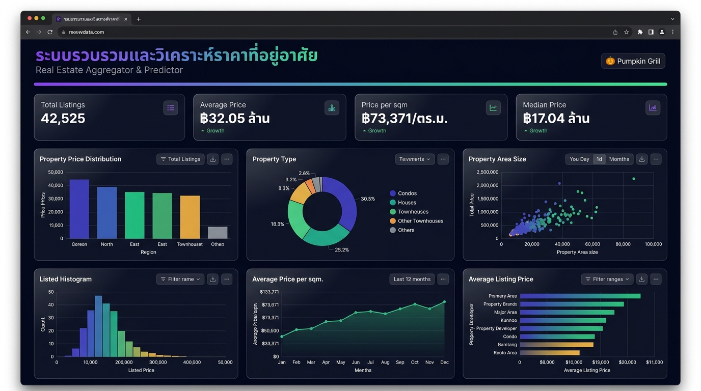
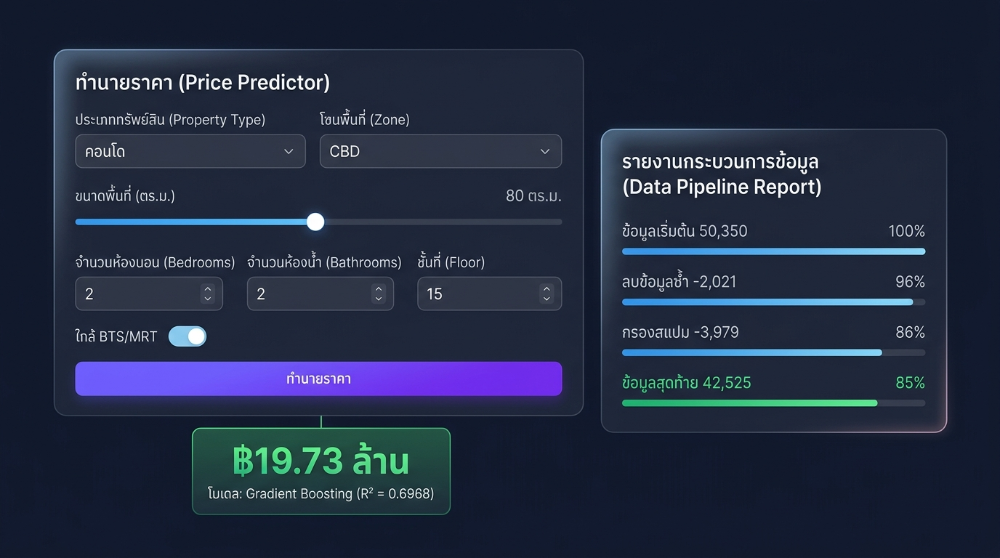

# 🏠 ระบบรวบรวมและวิเคราะห์ราคาที่อยู่อาศัย
### Real Estate Aggregator & Predictor

**กลุ่ม:** 🎃 Pumpkin Grill  
**รายวิชา:** 204426 Data Engineering

---

## 📸 ตัวอย่างหน้า Dashboard

### หน้าหลัก — สถิติ + กราฟวิเคราะห์


### ทำนายราคา + รายงาน Pipeline


---

## 📋 ภาพรวมของโปรเจกต์

โปรเจกต์นี้เป็น **ระบบ Data Pipeline แบบครบวงจร** ที่:
1. **รวบรวมข้อมูล** จาก 3 แหล่งข้อมูลอสังหาริมทรัพย์ (DDProperty, Baania, HipFlat)
2. **ทำความสะอาดข้อมูล** ที่มีปัญหา 15+ ประเภท (ข้อมูลซ้ำ, ค่าว่าง, สแปม, outlier)
3. **แปลงข้อมูล** ให้อยู่ในรูปแบบเดียวกัน (ราคา→THB, พื้นที่→ตร.ม., ทำเล→โซน)
4. **สร้างโมเดล ML** ทำนายราคาอสังหาริมทรัพย์ (R² = 0.70)
5. **แสดงผลด้วย Web Dashboard** แบบ interactive

## 🏗️ สถาปัตยกรรมระบบ

```
📥 Data Sources (3 แหล่ง)
 │  DDProperty (17K) + Baania (17K) + HipFlat (16K) = 50,350 records
 ▼
🧹 Data Cleaning (src/cleaning/cleaner.py)
 │  ลบซ้ำ 2,021 │ ค่าว่าง 1,322 │ สแปม 3,979 = ลบ 7,322
 ▼
🔄 Data Transformation (src/transformation/transformer.py)
 │  ราคา→THB │ พื้นที่→ตร.ม. │ ทำเล→โซน │ Feature Engineering
 ▼
🤖 ML Training (src/modeling/predictor.py)
 │  Linear Regression │ Random Forest │ Gradient Boosting ← ชนะ (R²=0.70)
 ▼
🌐 Flask Dashboard (app/server.py)
   Charts │ Prediction │ Data Table │ Pipeline Report
```

## 🚀 วิธีการติดตั้งและรัน

### 1. ติดตั้ง Dependencies
```bash
pip install -r requirements.txt
```

### 2. รัน Data Pipeline (สร้างข้อมูล + ทำความสะอาด + เทรนโมเดล)
```bash
python src/pipeline.py
```
> ⏱️ ใช้เวลาประมาณ 11 วินาที

### 3. รัน Web Dashboard
```bash
python app/server.py
```
> เปิดเบราว์เซอร์ไปที่ `http://localhost:8080`

### 4. รัน Tests
```bash
python -m pytest tests/test_pipeline.py -v
```

## 📊 ผลลัพธ์ Pipeline

| ขั้นตอน | ข้อมูลเริ่มต้น | ข้อมูลสุดท้าย | ที่ลบออก |
|---------|:----------:|:---------:|:------:|
| Generation | - | 50,350 | - |
| Cleaning | 50,350 | 43,028 | 7,322 |
| Transformation | 43,028 | 42,525 | 503 |

### ผลเปรียบเทียบ ML Models

| Model | MAE | RMSE | R² |
|-------|:---:|:----:|:--:|
| Linear Regression | ฿24.3M | ฿41.4M | 0.52 |
| Random Forest | ฿15.3M | ฿35.1M | 0.65 |
| **Gradient Boosting** ✅ | **฿15.8M** | **฿32.8M** | **0.70** |

## 🔧 เทคนิค Data Engineering ที่ใช้

### 1. Data Extraction (การดึงข้อมูล)
- Mock Scraper จาก 3 แหล่งข้อมูล รูปแบบต่างกัน
- DDProperty: คอลัมน์ภาษาอังกฤษ, ราคาเป็นตัวเลข
- Baania: คอลัมน์ภาษาไทย, ราคาเป็นข้อความ ("3.5 ล้าน")
- HipFlat: ราคา USD, พื้นที่แยก ไร่/งาน/วา
- Reference scraper template (`scraper_template.py`)

### 2. Data Cleaning (การทำความสะอาด)
- ลบข้อมูลซ้ำ (Exact + Fuzzy Deduplication)
- จัดการค่าว่าง (Imputation by property_type + zone)
- คัดกรองสแปม (เบอร์โทรในหัวข้อ, agent ads, ด่วน!!!)
- ลบ HTML/Emoji artifacts
- แก้ค่า negative, ค่า 0, ราคา/พื้นที่สลับกัน
- กรอง outlier ด้วย IQR

### 3. Data Transformation (การแปลงข้อมูล)
- แปลงราคาข้อความไทย → ตัวเลข ("3.5 ล้าน" → 3,500,000)
- แปลง USD → THB (×35)
- แปลงหน่วยพื้นที่ → ตร.ม. (วา×4, ไร่×1600, งาน×400)
- Normalize ชื่อทำเล (Sukhumvit → สุขุมวิท)
- จัดโซน: CBD, Inner City, Suburban, Outer
- Feature Engineering: price_per_sqm, has_bts, age_days

## 🌐 Dashboard Features

- **4 Stat Cards** — จำนวนประกาศ, ราคาเฉลี่ย, ราคา/ตร.ม., ค่ามัธยฐาน
- **6 Charts** — Bar, Doughnut, Scatter, Histogram, Line, Feature Importance
- **Price Predictor** — ฟอร์มทำนายราคาด้วย ML model
- **Pipeline Report** — แสดงขั้นตอนทำความสะอาดข้อมูล
- **Data Table** — กรองตามประเภท/โซน + pagination

## 💻 เทคโนโลยีที่ใช้

| Layer | Technology |
|-------|-----------|
| ภาษาหลัก | Python 3.9+ |
| จัดการข้อมูล | Pandas, NumPy |
| Machine Learning | scikit-learn, joblib |
| Web Server | Flask, Gunicorn |
| Frontend | HTML/CSS/JavaScript |
| Data Visualization | Chart.js |
| Deployment | Render |

## 📁 โครงสร้างโปรเจกต์

```
├── app/                          # Web Dashboard
│   ├── server.py                 # Flask API (8 endpoints)
│   ├── templates/index.html      # Dashboard UI
│   └── static/
│       ├── css/style.css         # Dark glassmorphism theme
│       └── js/dashboard.js       # Chart.js + interactions
├── src/                          # Data Pipeline
│   ├── extraction/
│   │   ├── mock_generator.py     # สร้าง 50K mock records
│   │   └── scraper_template.py   # Reference web scraper
│   ├── cleaning/
│   │   └── cleaner.py            # ทำความสะอาดข้อมูล
│   ├── transformation/
│   │   └── transformer.py        # แปลงข้อมูล + feature engineering
│   ├── modeling/
│   │   └── predictor.py          # ML training + prediction
│   └── pipeline.py               # Pipeline orchestrator
├── tests/
│   └── test_pipeline.py          # Test suite
├── data/                         # Generated data
├── models/                       # Trained ML models
├── docs/screenshots/             # Demo screenshots
├── requirements.txt
├── Procfile                      # Cloud deployment
├── render.yaml                   # Render config
└── README.md
```

---

**กลุ่ม Pumpkin Grill** 🎃 — วิชา 204426 Data Engineering
